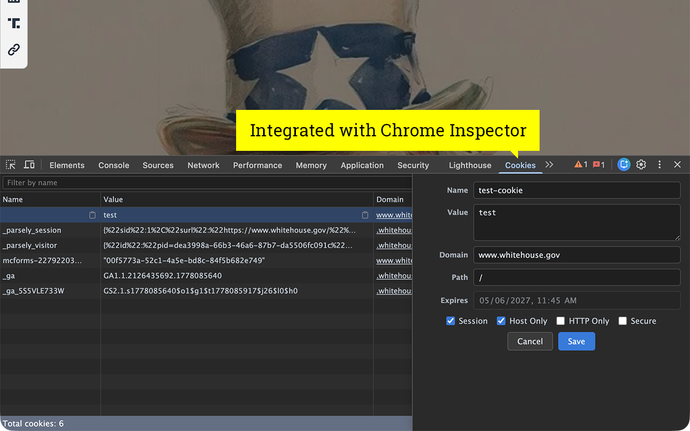

# Cookie Tab in DevTools

A cookie manager for Google Chrome. Edit and create cookies right
in the Developer Tools. Forked from [westoque/cookie_inspector](https://github.com/westoque/cookie_inspector). Now with proper dark mode support!



Features:

- View, Add, Edit, Remove Cookies
- Live Reloading (No need to close and open the inspector when you change URLs)
- Export Cookies

## Installation

1. Download `chrome-cookie-tab.zip` from the [latest release](https://github.com/dmhendricks/chrome-cookie-tab/releases/latest) and unzip it somewhere you'll remember.
2. Open Chrome and go to `chrome://extensions`.
3. In the top-right corner, turn on **Developer mode**.
4. Click **Load unpacked** and select the unzipped folder.
5. Open DevTools on any page (right-click → Inspect, or F12). The **Cookies** tab should appear.

To update later, download the new release zip, replace the unzipped folder's contents, and click the refresh icon on the extension's card in `chrome://extensions`.

## Development

Requires Node 20+.

```
npm install
npm run dev      # watch build, auto-reloads the extension
npm run build    # production build → dist/
npm run typecheck
npm run lint
```

Load the extension in Chrome from `chrome://extensions` → **Load unpacked** → select `dist/`.
