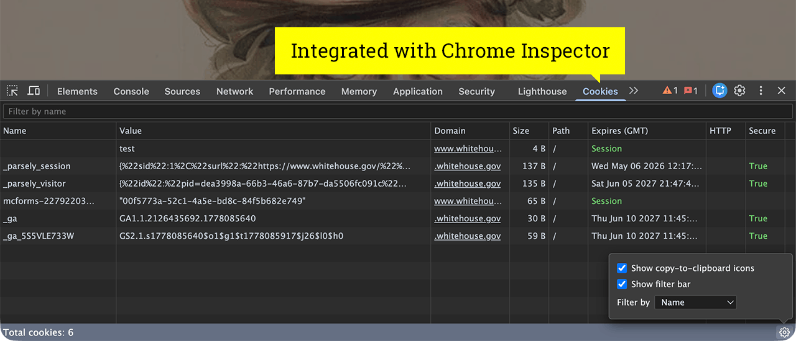

[](https://github.com/dmhendricks/chrome-cookies-tab/blob/main/LICENSE)
[![BrowserStack](https://img.shields.io/static/v1?style=social&label=BrowserStack&message=Passed&logo=data:image/png;base64,iVBORw0KGgoAAAANSUhEUgAAABwAAAAcCAMAAABF0y+mAAAAGXRFWHRTb2Z0d2FyZQBBZG9iZSBJbWFnZVJlYWR5ccllPAAAAyhpVFh0WE1MOmNvbS5hZG9iZS54bXAAAAAAADw/eHBhY2tldCBiZWdpbj0i77u/IiBpZD0iVzVNME1wQ2VoaUh6cmVTek5UY3prYzlkIj8+IDx4OnhtcG1ldGEgeG1sbnM6eD0iYWRvYmU6bnM6bWV0YS8iIHg6eG1wdGs9IkFkb2JlIFhNUCBDb3JlIDUuNi1jMTQ1IDc5LjE2MzQ5OSwgMjAxOC8wOC8xMy0xNjo0MDoyMiAgICAgICAgIj4gPHJkZjpSREYgeG1sbnM6cmRmPSJodHRwOi8vd3d3LnczLm9yZy8xOTk5LzAyLzIyLXJkZi1zeW50YXgtbnMjIj4gPHJkZjpEZXNjcmlwdGlvbiByZGY6YWJvdXQ9IiIgeG1sbnM6eG1wPSJodHRwOi8vbnMuYWRvYmUuY29tL3hhcC8xLjAvIiB4bWxuczp4bXBNTT0iaHR0cDovL25zLmFkb2JlLmNvbS94YXAvMS4wL21tLyIgeG1sbnM6c3RSZWY9Imh0dHA6Ly9ucy5hZG9iZS5jb20veGFwLzEuMC9zVHlwZS9SZXNvdXJjZVJlZiMiIHhtcDpDcmVhdG9yVG9vbD0iQWRvYmUgUGhvdG9zaG9wIENDIDIwMTkgKE1hY2ludG9zaCkiIHhtcE1NOkluc3RhbmNlSUQ9InhtcC5paWQ6NzQ5NjEyQzJDMzUxMTFFOTlBNkZDNEVGRUQ3QUI4RDkiIHhtcE1NOkRvY3VtZW50SUQ9InhtcC5kaWQ6NzQ5NjEyQzNDMzUxMTFFOTlBNkZDNEVGRUQ3QUI4RDkiPiA8eG1wTU06RGVyaXZlZEZyb20gc3RSZWY6aW5zdGFuY2VJRD0ieG1wLmlpZDo3NDk2MTJDMEMzNTExMUU5OUE2RkM0RUZFRDdBQjhEOSIgc3RSZWY6ZG9jdW1lbnRJRD0ieG1wLmRpZDo3NDk2MTJDMUMzNTExMUU5OUE2RkM0RUZFRDdBQjhEOSIvPiA8L3JkZjpEZXNjcmlwdGlvbj4gPC9yZGY6UkRGPiA8L3g6eG1wbWV0YT4gPD94cGFja2V0IGVuZD0iciI/PhdfVWUAAAGAUExURXjIMP/Rhf/Xn4mHhwpRXnrY8CIXFv41Sk68OACv2QC+6svIAP5oEAC+6H7ToKa3nP9fF//AT/+tfPjVzpTPHf+6Rf1GLcbVAJDd8P/9+v/qyf/EY/+mNXHLidKyF126Mv/26anm8/+8TP/68P1jAFHO8lPAYu+SDqrh7v+xR/0eOgC/rIGvM7SvI9qKjAC+6lG5wf+SM/+2mOGnGf8NMgCcvLLEw5OZOv0yMfvARRfD7v+VSf9lZ/9mOqTs9lvAQ/+EK/+VY7Hr/f+cN0+7Lb2FMuqFG7tuOv9jEOCLLP93JKzj+ZDYwwC9s2LLrQB8k/9wEv+4R/9oD5/g1b3iAACtygCJo//w6MnHyPM5M+h3NuVyfcLPZP9MWKOYXMevu/+Xn5HG06nWAwDG8pzn6//lsZ/l85rik/+def/38fNoILPS3/1tF/+3Zf+sROmuICWPq3edprrG0VTW26jn/EhteD7CN9ibbgC8t/96NPmLQIjPY/9CKSQfIP///////+tAimMAAACAdFJOU/////////////////////////////////////////////////////////////////////////////////////////////////////////////////////////////////////////////////////////////////////////8AOAVLZwAAAj9JREFUeNpU0vtb0lAYB/CzCTgeDrQpGwyUyzZwwwyBmTRNELwgkYpQZkUXumktyrJ13eFf9z0CZd8ftufZZ9/znPOcFw1HIWezp+u9Xm/9xaw8nASNXsczfNk0c2VJOjGni2fXkRQ1KWeWdxKBSCSS2DuZZslflDepPX76LrS/P/+7343slWfkMRJque+djGXlIcuo301IH+URFjU+Z97ayAAEIfl8NtxN3GUIxWMNS+aTDS/QysHBij8YXOTC3b21N4DkFIrTH95alt/j+nw+z0owmE32A78UdYhS2JZg0aiV9/hc1zc1C7q4hbolgx0ilgd8vuG1HoK5rkxcT/B+kusHDEFGm5ot5b6kvZbnCh9Nua7/R5ILR9piDP3EVxgdowtPPzRR5I7IIpvi7bSeGSPEvzhCBjUp3rjQo5/H6PO8mt8CbCtxuixvPnut695J1f+1wnHhgAG4pmG7vBu6p6ej367O+cALRa7/SQQsahjzJ8kWaPrl+fmy9yIEVgnUBdhQ7BBj+8+uE9KBa7WaTntcf2EgwFHkAlSxtOpkQ61OpxWqUAuXqoKiyIgwUMVHoFtcpcJRclAJG7AqQUN1DlPlt5OO44A4laUFvi4oYgqujLB1qrjxfnv1JmRp54gvgMGowGXL8blDnpYbDfpPg7dpLy6PZkgVjCrW8Cg8rhpggjqZPjUuGoWmDWQ3CwOB9tR/cyuzoqC0B4OBoVASWfn6UJMUo4gAVBQmRf6beGA1xsQVJc7EVDL5dinAAO2UucfjcPEkAAAAAElFTkSuQmCC)](https://browserstack.com/?utm_source=github.com&utm_medium=referral&utm_content=link&utm_campaign=dmhendricks%2Fchrome-cookies-tab)

# Cookies Tab in DevTools

This Chrome extension allows you to easily browse, filter and modify cookies via a custom tab in Chrome Developer Tools. Multi-select rows for bulk delete or export, copy values with one click, and fetch a fresh cookie list automatically as you navigate. Forked from [westoque/cookie_inspector](https://github.com/westoque/cookie_inspector) and modernized.



Features:

- View, add, edit, filter and delete cookies
- Live reloading (no need to close and open the inspector when you change URLs)
- Import and export cookies

## Installation

The easiest way to install the extension is from the [Chrome Web Store](https://chromewebstore.google.com/detail/cookies-tab-in-devtools/nifkepndinooddpphmpmlkimamhbjdhd).

Alternatively, you can install from the ZIP file:

1. Download `chrome-cookies-tab.zip` from the [latest release](https://github.com/dmhendricks/chrome-cookies-tab/releases/latest) and unzip it somewhere you'll remember.
2. Open Chrome and go to `chrome://extensions`.
3. In the top-right corner, turn on **Developer mode**.
4. Click **Load unpacked** and select the unzipped folder.
5. Open DevTools on any page (right-click → Inspect, or F12). The **Cookies** tab should appear.

To update later, download the new release zip, replace the unzipped folder's contents, and click the refresh icon on the extension's card in `chrome://extensions`.

## Development

Requires Node 20+.

```
npm install
npm run dev      # watch build, auto-reloads the extension
npm run build    # production build → dist/
npm run typecheck
npm run lint
```

Load the extension in Chrome from `chrome://extensions` → **Load unpacked** → select `dist/`.

## Translations

- **Translations done by AI:** Spanish, French, German, Italian, Turkish, Polish, Romanian, Dutch, Czech, Portuguese
- **Translations done by humans:** Chinese (Simplified), Korean, Japanese, Russian

If you spot an error or opportunities for improvement, please submit it.

### Option 1 - Submit a Pull Request

The extension uses Chrome's built-in [`chrome.i18n`](https://developer.chrome.com/docs/extensions/reference/api/i18n) API. Adding a new language is a single drop-in JSON file — no code changes.

To contribute a translation:

1. Copy [`public/_locales/en/messages.json`](public/_locales/en/messages.json) to `public/_locales/<lang>/messages.json`, where `<lang>` is a [Chrome-supported locale code](https://developer.chrome.com/docs/extensions/reference/api/i18n#supported-locales) (`es`, `fr`, `de`, `ja`, `pt_BR`, …).
2. Translate the `message` fields. Leave the keys, `description` fields, and `placeholders` blocks untouched — `description` is for translator context, and placeholders like `$COUNT$` are substituted at runtime by Chrome.
3. Submit a pull request.

### Option 2 - Submit an Issue

If you don't know how or don't want to submit a pull request, you can simply make a copy of [messages.json](https://github.com/dmhendricks/chrome-cookies-tab/blob/main/public/_locales/en/messages.json) and translate (replace) all the `message` field values from English to the target language. **Do not** change any of the other strings (leave them in English). Once completed, post your translation in [Issues](https://github.com/dmhendricks/chrome-cookies-tab/issues) for review.
